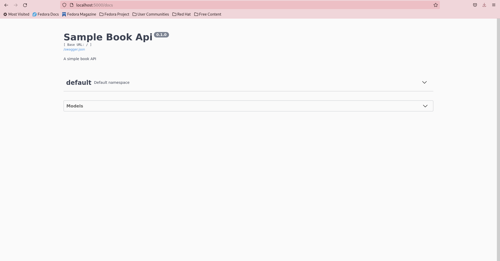
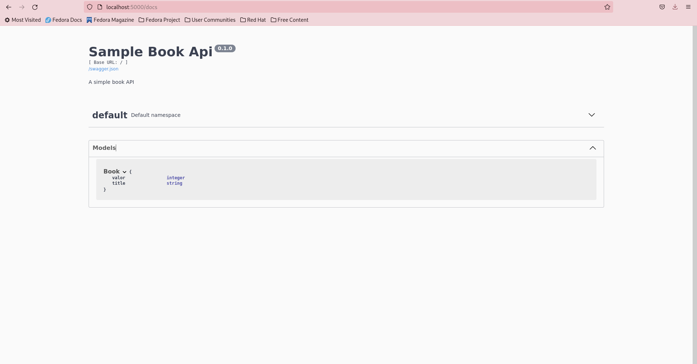
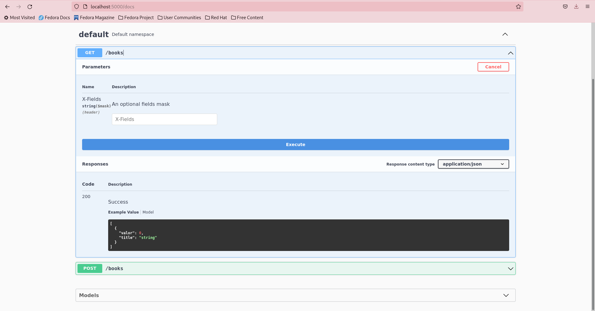
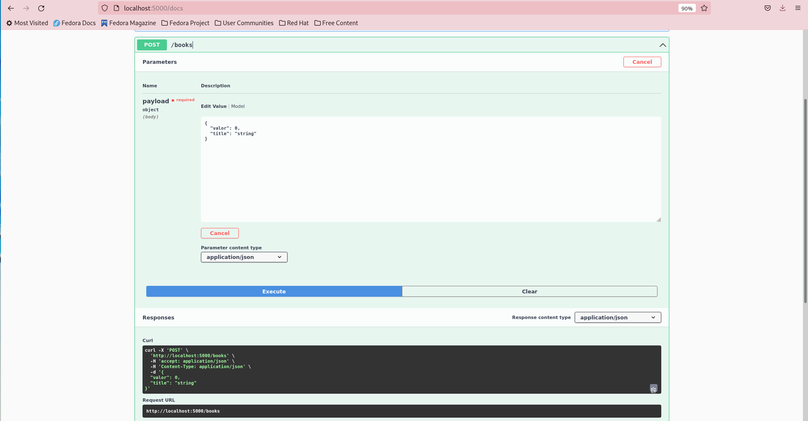

# Read Me


---

### Table of Contents

- [Read Me](#read-me)
    - [Table of Contents](#table-of-contents)
  - [Description](#description)
    - [Technologies](#technologies)
  - [Instalação](#instalação)
  - [References](#references)
  - [Exemplo de uso](#exemplo-de-uso)
  - [Author Info](#author-info)

---

## Description

Rest api utilizando flask framework e MongoDB, foram criados rotas de get e post que buscam e inserem dados em um MongoDB, a documentacao swagger foi gerada automaticamente pelo flask Restx.


### Technologies

- Flask
- Flask-restx
- Pymongo
- MongoDB

[Back To The Top](#read-me)

---

## Instalação
É necessária a instalação prévia das ferramentas 

    - Docker 
    - Docker-compose

```html
    $ docker-compose build
    $ docker-compose up -d
```
[Back To The Top](#read-me)

---

## References
 - [Flask Docs](https://flask.palletsprojects.com/en/2.0.x/)
 - [Flask RestX](https://flask-restx.readthedocs.io/en/latest/swagger.html#the-api-marshal-with-decorator)
 - [ Pedro Impulcetto](https://www.youtube.com/channel/UCsnD5AhrIq7BvKvZFKLT-pQ)
 - [Live de Python](https://www.youtube.com/watch?v=PHHXksljGNA&list=PLOQgLBuj2-3LqnMYKZZgzeC7CKCPF375B)

[Back To The Top](#read-me)

---
## Exemplo de uso
- docs homepage
    
- schema
    
- get
    
- post
    
---
## Author Info
- Linkedin - [@João Paulo Marques](https://www.linkedin.com/in/jo%C3%A3o-paulo-marques-705bb516b/)
- Instagram - [@paulo.marques.13](https://www.instagram.com/paulo.marques.13/)
- GitHub -  [@jpmarques-97](https://github.com/jpmarques-97/)

[Back To The Top](#read-me)